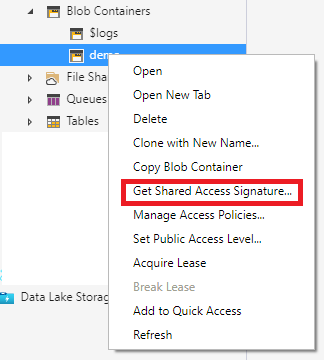
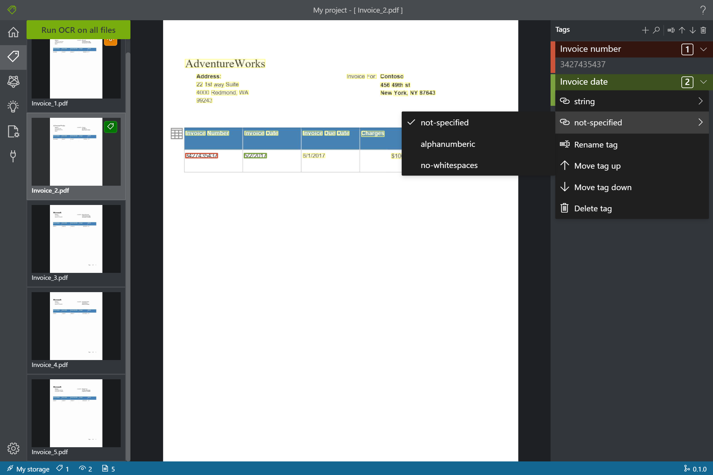

# Form OCR Testing Tool

Form Recognizer の改善にご協力ください。[Take our survey!](https://aka.ms/FR-HaTS-Survey)

## 機能プレビュー

[](https://dev.azure.com/msazure/Cognitive%20Services/_build/latest?definitionId=118293&branchName=master)

[Form Recognizer](https://docs.microsoft.com/en-us/azure/cognitive-services/form-recognizer/) のオープンソースの Labeling Tool で、Form OCR Test Toolset (FOTT) の一部です。

これはツールの `MAIN` ブランチです。これは、利用可能なすべての最新機能を含んでいます。プレビューのため、最も安定したバージョンでは**ありません**。

このリポジトリの目的は、お客様が Microsoft Forms と OCR サービスを使用する際に、最新のツールをテストできるようにすることです。現在のところ、Labeling Tool がここで紹介する最初のツールです。ユーザーはフィードバックを提供し、独自のニーズを満たすために顧客固有の変更を行うことができます。Microsoft Azure Form Recognizer チームは、定期的にソースコードを更新する予定です。コントリビュートしたいと思われる方は、コントリビュートのセクションをご覧ください。

**このツールの最新の GA バージョンをチェックしたい方は、こちらの[リンク]((https://github.com/microsoft/OCR-Form-Tools/tree/v2.0-General-Availability-Release))をご覧ください。**

___

FOTT の Labeling Tool は、TypeScript を使った React + Redux の Web アプリケーションです。このプロジェクトは [Create React App](https://github.com/facebook/create-react-app) でブートストラップしています。

現在の Labeling Toolの機能 ([こちら](https://youtu.be/GRGs18lZJ1E?t=462)でショートデモが見れます)

* PDF、JPEG、TIFF 形式のフォームに**ラベルを付ける**
* [Form Recognizer](https://docs.microsoft.com/en-us/azure/cognitive-services/form-recognizer/) でラベル付けされたデータを使ってモデルを**学習する**
* 学習したモデルを使ってフォームを**予測／分析**をし、そのフォームから予測／分析した結果のキー・バリューを抽出

## Getting Started

### ソースからビルドして実行

Form Labeling [NodeJS (>= 10.x, Dubnium) and NPM](https://github.com/nodejs/Release) が必須です。

   ```bash
    git clone https://github.com/Microsoft/OCR-Form-Tools.git
    cd OCR-Form-Tools
    yarn install
    yarn build
    yarn start
   ```

### Docker でセットアップ

[こちら](https://docs.microsoft.com/en-us/azure/cognitive-services/form-recognizer/quickstarts/label-tool#set-up-the-sample-labeling-tool)の説明をご覧ください。また、最新のコンテナーイメージの情報については、[こちら](https://hub.docker.com/_/microsoft-azure-cognitive-services-custom-form-labeltool?tab=description)の docker hub リポジトリをご覧ください。

* `latest` の docker image tags は、FOTT の一般利用可能なリリースをトラッキングしています。
* `latest-preview` の docker image tags は、FOTT のプレビューリリースをトラッキングします。
* `latest-preview-private` の docker image tags は、FOTT のプライベートプレビューリリースをトラッキングします。

### Web アプリケーションを実行

最新の Web ブラウザを使って、FOTT を直接起動することができます:

* https://fott.azurewebsites.net/  (for Form Recognizer 2.0 GA services)
* https://fott-preview.azurewebsites.net/  (for Form Recognizer 2.1-preview.* services)
* https://fott-preview-private.azurewebsites.net/  (for Form Recognizer Private 2.1-preview.* services)

**Note: これらのウェブアプリはテスト目的のみです。ローカルホストでない限り HTTPS が必要です。**

### デスクトップアプリケーションとして実行

FOTT は、初期設定後デスクトップアプリケーションとして動作させることができます。

   ```bash
    yarn electron-start
   ```

デスクトップアプリケーションには、以下のような追加機能があります。

* プロバイダのストレージとしてのローカルファイルシステムのサポート
* クロスドメインでのリソース要求のサポート


### デスクトップアプリケーションとしてリリース

FOTT は、配布可能なデスクトップアプリケーションとしてリリースすることができます。

   ```bash
    yarn release
   ```

配布物はクローンしたリポジトリのreleaseフォルダに保存されます。


## Labeling tool の仕様

### 入力データのセットアップ

ラベル・トレーニング・分析のシナリオを完全に実行するためには、同じタイプのフォームが少なくとも6つ必要になります。 5つのフォームにラベルを付けてモデルを学習し、1つのフォームでモデルをテストします。[サンプルファイル](https://go.microsoft.com/fwlink/?linkid=2090451)を、Azure Storage アカウントの Blob ストレージコンテナーのルートにアップロードすることができます。アップロードには [Azure Storage Explorer](https://azure.microsoft.com/en-us/features/storage-explorer/) を使うことができます。  
たくさんの異なるフォーマットのフォームがあるような高度なシナリオでは、類似したフォーマットに基づいてサブフォルダに整理することができます。 1つのフォーマットからモデルを学習するようにプロジェクトを設定する際には、プロジェクトの設定ページでサブフォルダを指定する必要があります。

#### Cross-domain resource sharing (CORS) を構成する

ストレージアカウントでCORSを有効にすることができます。Azureポータルでストレージアカウントを選択し、左ペインの「**CORS**」タブをクリックします。一番下の行で以下の値を入力します。その後、上部の **Save** をクリックします。

* Allowed origins = *
* Allowed methods = [select all]
* Allowed headers = *
* Exposed headers = *
* Max age = 200


### Connections の作成

Form OCR Testing Tool は、"Bring Your Own Data"（BYOD）アプリケーションです。このツールでは、接続を使用してソース（ラベルを付けるアセット）とターゲット（ラベルをエクスポートする場所）を設定・管理します。ソースとターゲットは、Form OCR Testing Tool では同じ場所になります。最終的にこれらを合わせて [Form Recognizer](https://docs.microsoft.com/en-us/azure/cognitive-services/form-recognizer/) への入力となります。
Connections はプロジェクト間で設定して共有することができます。また、拡張可能なプロバイダーモデルのため、新しいソース/ターゲットプロバイダーを簡単に追加することができます。

現時点で labeling tool と [Form Recognizer](https://docs.microsoft.com/en-us/azure/cognitive-services/form-recognizer/) は、Azure の blob ストレージのみをサポートしています。

新しい接続を作成するには、左のナビゲーションバーにある `New Connections` (plug) アイコンをクリックします。

以下のようにフィールドに値を入力してください。

* **Display Name** - 接続の表示名
* **Description** - プロジェクトの概要
* **SAS URL** - Azure blob ストレージ コンテナーの shared access signature (SAS) URL です。SASのURLを取得するには、Microsoft Azure Storage Explorerを開き、コンテナー（注：親ストレージノードでも Azureポータルの URL でもありません）を右クリックして、"Shared Access Signature の取得" を選択します。有効期限にはサービスの利用を終える時間以降に設定します。「読み取り」「書き込み」「削除」「リスト」の権限がチェックされていることを確認し「作成」をクリックします。次に、URI セクションの値をコピーします。次のような形式になっているはずです: https://&lt;storage account&gt;.blob.core.windows.net/&lt;container name&gt;?&lt;SAS value&gt;.




### 新しいプロジェクトの作成

このラベリングツールでは、プロジェクトを使って設定や構成を保存します。新しいプロジェクトを作成し、以下のように各フィールドに値を入力してください:

* **Display Name** - プロジェクトの表示名
* **Security Token** - プロジェクトの設定には、APIキーやその他の共有のシークレットなど機密性の高い値が含まれる場合があります。各プロジェクトでは、機密性の高いプロジェクト設定を暗号化／復号化するためのセキュリティトークンが生成されます。セキュリティートークンは、左ナビゲーションバーの下隅にある歯車のアイコンをクリックして、Application Settings の中で確認できます。
* **Source Connection** - 前のステップで作成した、このプロジェクトで使用する Azure Blob ストレージのコンテナーの接続です。
* **Folder Path** - Optional -  ソースのフォームが Blob コンテナーのサブフォルダにある場合、そのフォルダ名をここで指定します。
* **Form Recognizer Service Uri** - Form Recognizer の エンドポイントの URL。次のようなフォーマットです: https://&lt;your-name&gt;.cognitiveservcices.azure.com.
* **API Key** - Form Recognizer の subscription key。
* **Description** - Optional - プロジェクトの概要。


### フォームにラベルを付ける

プロジェクトを作成/開くと、タグエディターのメインウィンドウが開きます。タグエディターは3つのパートで構成されています。

* Preview pane には、ソースの Connection にあるフォームの一覧が表示されます。
* Main editor pane は、タグを適用してテキストにラベルを付けることができます。
* Tags editor pane は、タグの変更、並び替え、削除ができます。

#### テキストとテーブルの識別

左ペインの **Run OCR on all files** をクリックすると、各ドキュメントのテキストレイアウト情報が表示されます。Labeling tool は、各テキスト要素の周囲にバウンディングボックスを描画し、テーブルには左上にアイコンを表示します。テーブルのアイコンをクリックすると、そのテーブルの識別された境界線が表示されます。

#### テキストにラベルを適用

次に、ラベルを作成して、モデルに認識させたいテキスト要素に適用します。モデルを学習させて抽出したい文書には、多くのキーと値のペアがありますが、最初のステップはキーと値のペアの値をラベル付けすることです。 例えば、フォームに `Charge.1002.00` というテキストがあり、フォームに「1002.00」というテキストがあり、その値 (1002.00) にラベルを付けたいとします。そうすれば、類似したフォームからそのような情報を抽出するようにAIモデルを学習させることができます。

1. 最初に、tags エディターペインで、例えば "Cost" といった識別したいタグ（ラベル）を作成します。

2. メインエディターでクリックとドラッグして、ハイライトされたテキスト要素から1つまたは複数の単語を選択します。例えば "1002.00" です。注：現在、複数のページにまたがるテキストを選択することはできません。

3. 適用したいタグをクリックするか、対応するキーボードキーを押します（例：最初のタグはキー "1"）。選択したテキスト要素に適用できるタグは1つだけで、各タグは1ページにつき1回しか適用できません。

以上の手順で5つのフォームにラベルをつけ、次のステップに進みます。


#### タグのタイプとフォーマットの指定

タグのタイプとフォーマットは、タグのコンテキストメニューで指定できます。タイプとフォーマットの情報は、ソースと同じ場所の fields.json に保存されます。これらの情報は、より良い結果を得るために後処理で使用されます。



#### カスタムモデルをトレーニングする

左ペインの "Train" アイコンをクリックして "Training" ページを開きます。次に "Train" ボタンをクリックしてモデルのトレーニングを開始します。トレーニングプロセスが完了すると、以下の情報が表示されます。

* **Model ID** - 作成してトレーニングされたモデルの ID です。トレーニングを行うたびに独自の ID を持つ新しいモデルが作成されます。この文字列を安全な場所にコピーしてください。REST API を使って予測・分析を行う場合に必要となります。
* **Average Accuracy** - モデルの平均精度です。追加のフォームにラベルを付け再度トレーニングを行ってモデルを作成することで、モデルの精度を向上させることができます。まずは5つのフォームにラベルを付け、必要に応じてフォームを追加することをお勧めします。
* タグの一覧と、タグごとの推定精度が表示されます。


トレーニングが終了したら **Average Accuracy** の値を確認します。もし Average Accuracy  が低い場合は、ドキュメントを追加して上記の手順を繰り返す必要があります。ラベル付けされたドキュメントは、プロジェクトのインデックスに残ります。

Tip: REST APIコールでトレーニングプロセスを実行することもできます。その方法については [Train with labels using Python](https://docs.microsoft.com/en-us/azure/cognitive-services/form-recognizer/quickstarts/python-labeled-data) をご覧ください。

#### フォームの分析 ####

左ペインの Analyze アイコンをクリックすると Analyze ページが表示されます。トレーニングプロセスで使用していないフォームのドキュメントをアップロードします。右側の **Analyze** ボタンをクリックすると、フォームの予測/分析の結果がキーバリューで表示されます。


Tip: REST APIコールでトレーニングプロセスを実行することもできます。その方法については [Train with labels using Python](https://docs.microsoft.com/en-us/azure/cognitive-services/form-recognizer/quickstarts/python-labeled-data) をご覧ください。

#### モデルの合成 ####

左ペインの Compose アイコンをクリックすると、Compose ページが表示されます。FoTTは、あなたのモデルの最初のページを Model ID の降順でリストに表示します。1つのモデルに合成したいモデルを複数選択し、**Compose** ボタンをクリックします。新しいモデルが構成されると、解析ができるようになります。


さらにモデルを読み込むには、 リストの下部にある **Load next page** をクリックします。Model ID の降順で次のページが表示されます。

リストの上部にある列のヘッダーをクリックして、現在読み込まれているモデルをソートできます。ソートされるのは現在ロードされているモデルだけです。 最初にモデルの全てのページをロードすることで、モデルのリストを全てソートすることができます。

#### Save a project and resume later ####

別の時や別のブラウザーでプロジェクトを再開するには、プロジェクトのセキュリティトークンを保存し、後で再入力する必要があります。

##### プロジェクトのクレデンシャルを取得 #####

Project Settings ページ (document setting アイコン) に移動し、Security token の名称を確認します。次に Application Settings (Gear のアイコン) に移動すると、現在のブラウザーのインスタンスの全ての Security token が表示されます。プロジェクトの Security token を見つけ、その名称とキーの値を安全な場所にコピーします。

##### プロジェクトのクレデンシャルを復元 #####

プロジェクトを再開する際には、まず同じ Blob ストレージコンテナへの接続を作成する必要があります。これを行うには上記の手順を繰り返します。次に Application Settings ページ(Gear のアイコン）に移動し、プロジェクトのセキュリティトークンがあるかを確認します。表示されていない場合は、新しいセキュリティートークンを追加し、前の手順で設定したトークンの名前とキーの値をコピーします。そして Save Settings をクリックします。

##### プロジェクトの再開 #####

最後に Main ページ (Homeのアイコン) に移動し、Open Cloud Project をクリックします。Blob ストレージの接続を選択しプロジェクトの .proj ファイルを選択します。アプリケーションはセキュリティトークンを持っているので、プロジェクトのすべての設定を読み込みます。

##### プロジェクトの共有

FoTTでは、このツールを使っている人とプロジェクトを共有しプロジェクトが置かれている同じ Azure Blob Storage コンテナーへのアクセスを共有することができます。
プロジェクトを共有するには以下の手順に従ってください:

###### 送信する側:

1. 共有したいプロジェクトを開きます。右上の隅にある "share" アイコン .をクリックします。共有の文字列がクリップボードに保存されたというメッセージがポップアップで表示されます。  
2. クリップボード内の文字列を任意の方法で共有することができます。

###### 受け取る側:

1. "Home Page"に移動し "Open Cloud Project" をクリックします。
2. ポップアップに適切なフィールドに共有の文字列を入力します。
3. OK をクリックします。

#### キーボードショートカットと便利な Tips ####

Labeling tool にはアクセシビリティに対応するため、また、ラベリングをより簡単かつ迅速に行うためにいくつかのキーボードショートカットが用意されています。タイトルバーの右端にある以下のアイコンをクリックすると表示されます:\


最初の36個のタグには、1～0とすべての文字がホットキーに割り当てられており、ハイライトされたテキスト要素から1つまたは複数の単語を選択した後、これらのホットキーを押すことで選択した単語にラベルを付けることができます。

'[' と ']' キーは、選択を前または次の単語に移動させることができます。

'<' と '>' キーは、複数ページのドキュメントの前のページや次のページに移動することができます。

'-', '+' と '/' キーは、編集ページのズームイン/アウトやリセットができます。

Alt キーを押しながらタグ名をクリックすると、タグの名前を変更できます。

タグのラベルを全て削除するには、ドキュメント上のあるタグのラベルをすべて選択し 'delete' キーを押します。

## Collaborators

This project is cloned and modified from [VoTT](https://github.com/microsoft/VoTT) project.

## Contributing

There are many ways to contribute to Form OCR Testing Tool -- please review our [contribution guidelines](CONTRIBUTING.md).

This project has adopted the [Microsoft Open Source Code of Conduct](https://opensource.microsoft.com/codeofconduct/). For more information see
the [Code of Conduct FAQ](https://opensource.microsoft.com/codeofconduct/faq/) or contact [opencode@microsoft.com](mailto:opencode@microsoft.com)
with any additional questions or comments.

* [English](README.md)
* [简体中文](README.zh-cn.md)

