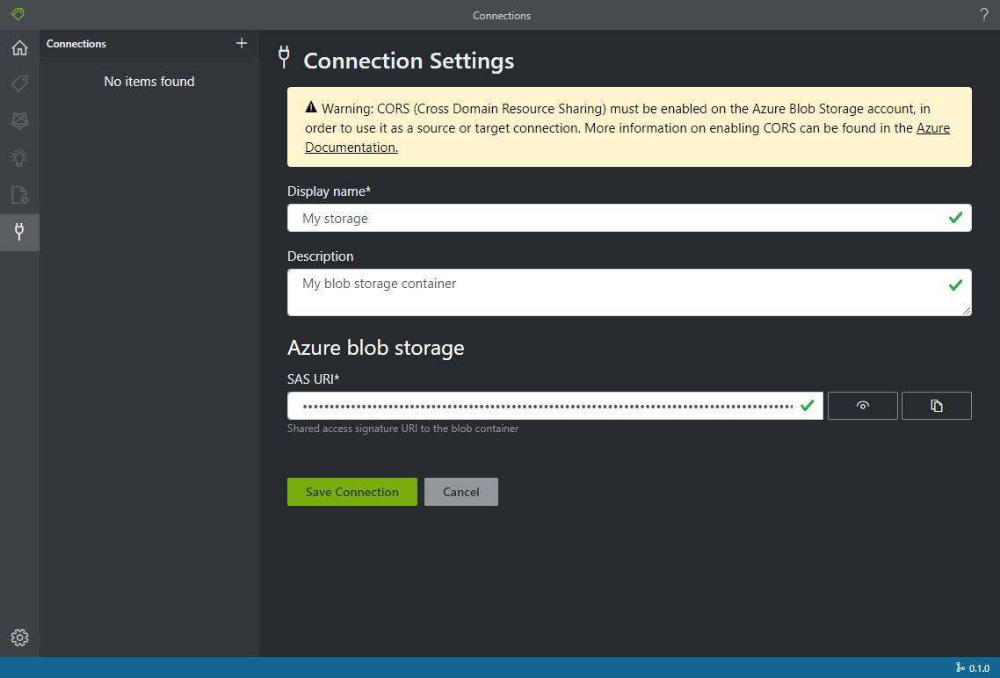

# OCR Form Labeling Tool

[](https://dev.azure.com/msazure/Cognitive%20Services/_build/latest?definitionId=118293&branchName=master)

An open source labeling tool for [Form Recognizer](https://docs.microsoft.com/en-us/azure/cognitive-services/form-recognizer/)

The purpose of this repo is to allow customers to better understand our labeling tool,  provide feedback, and make customer-specific changes to meet their unique needs.  Microsoft Azure Form Recognizer team will update the source code periodically.  If you would like to contribute, please check the contributing section.

OCR Form Labeling Tool is a React + Redux Web application, write in [TypeScript](https://github.com/Microsoft/TypeScript). This project was bootstrapped with [Create React App](https://github.com/facebook/create-react-app).

Features include:

* The ability to label forms in PDF, JPEG or TIFF formats
* Train model with labeled data through [Form Recognizer](https://docs.microsoft.com/en-us/azure/cognitive-services/form-recognizer/)
* Predict a single form with the trained model

## Getting Started

### Build and run from source

Form Labeling Tool requires [NodeJS (>= 10.x, Dubnium) and NPM](https://github.com/nodejs/Release)

   ```bash
    git clone https://github.com/Microsoft/OCR-Form-Tools.git
    cd OCR-Form-Tools
    npm run build
    npm run react-start
   ```
## Using labeling tool

### Set up input data

First, make sure all the training documents are of the same format. If you have forms in multiple formats, organize them into subfolders based on common format. When you train, you'll need to direct the API to a subfolder.

#### Configure cross-domain resource sharing (CORS)

Enable CORS on your storage account. Select your storage account in the Azure portal and click the **CORS** tab on the left pane. On the bottom line, fill in the following values. Then click **Save** at the top.

* Allowed origins = *
* Allowed methods = [select all]
* Allowed headers = *
* Exposed headers = *
* Max age = 200


### Create Connections

OCR Form Labeling Tool is a 'Bring Your Own data' (BYOD) application. In this tool, connections are used to configure and manage source (the assets to label) and target (the location to which labels should be exported). The source and target are the same location in OCR Form Labeling Tool. Eventually, they together will be inputs to [Form Recognizer](https://docs.microsoft.com/en-us/azure/cognitive-services/form-recognizer/).
Connections can be set up and shared across projects. They use an extensible provider model, so new source/target providers can easily be added.

Currently, both this labeling tool and [Form Recognizer](https://docs.microsoft.com/en-us/azure/cognitive-services/form-recognizer/) only support [Azure Blob Storage](https://docs.microsoft.com/en-us/azure/storage/blobs/storage-blobs-introduction).

To create a new connection, click the `New Connections` (plug) icon, in the left hand navigation bar.

Fill in the fields with the following values:

* **Display Name** - The connection display name.
* **Description** - Your project description.
* **SAS URL** - The shared access signature (SAS) URL of your Azure Blob Storage container. To retrieve the SAS URL, open the Microsoft Azure Storage Explorer, right-click your container, and select Get shared access signature. Set the expiry time to some time after you'll have used the service. Make sure the Read, Write, Delete, and List permissions are checked, and click Create. Then copy the value in the URL section. It should have the form: https://<storage account>.blob.core.windows.net/<container name>?<SAS value>.



### Create a new project

In the sample labeling tool, projects store your configurations and settings. Create a new project and fill in the fields with the following values:

* **Display Name** - the project display name
* **Security Token** - Some project settings can include sensitive values, such as API keys or other shared secrets. Each project will generate a security token that can be used to encrypt/decrypt sensitive project settings. You can find security tokens in the Application Settings by clicking the gear icon in the lower corner of the left navigation bar.
* **Source Connection** - The Azure Blob Storage connection you created in the previous step that you would like to use for this project.
* **Folder Path** - Optional - If your source forms are located in a folder on the blob container, specify the folder name here
* **Form Recognizer Service Uri** - Your Form Recognizer endpoint URL.
* **API Key** - Your Form Recognizer subscription key.
* **Description** - Optional - Project description


### Label your forms

When you create or open a project, the main tag editor window opens. The tag editor consists of three parts:

* A preview pane that contains a scrollable list of forms from the source connection.
* The main editor pane that allows you to apply tags.
* The tags editor pane that allows users to modify, reorder, and delete tags.

#### Identify text elements

Click **Run OCR on all files** on the left pane to get the text layout information for each document. The labeling tool will draw bounding boxes around each text element.

#### Apply labels to text

Next, you'll create labels and apply them to the text elements that you want the model to recognize.

1. First, use the tags editor pane to create the tags (labels) you'd like to identify.

2. In the main editor, click and drag to select one or multiple words from the highlighted text elements. Note: You cannot currently select text that spans across multiple pages.

3. Click on the tag you want to apply, or press corresponding keyboard key. You can only apply one tag to each selected text element, and each tag can only be applied once per page.

Follow the above steps to label five of your forms, and then move on to the next step.


#### Specify tag type and format

You can specify tag type and format with tag contextual menu. The type and format information will be stored in fields.json in the source location. The information will be used in post processing to get better result.


#### Train a custom model

Click the Train icon (the train car) on the left pane to open the Training page. Then click the **Train** button to begin training the model. Once the training process completes, you'll see the following information:

* **Model ID** - The ID of the model that was created and trained. Each training call creates a new model with its own ID. Copy this string to a secure location; you'll need it if you want to do prediction calls through the REST API.
* **Average Accuracy** - The model's average accuracy. You can improve model accuracy by labeling additional forms and training again to create a new model. We recommend starting by labeling five forms and adding more forms as needed.
* The list of tags, and the estimated accuracy per tag.


After training finishes, examine the **Average Accuracy** value. If it's low, you should add more input documents and repeat the steps above. The documents you've already labeled will remain in the project index.

Tip: You can also run the training process with a REST API call. To learn how to do this, see [Train with labels using Python](https://docs.microsoft.com/en-us/azure/cognitive-services/form-recognizer/quickstarts/python-labeled-data).

#### Analyze a form ####

Click on the Predict icon on the left to test your model. Upload a form document that you haven't used in the training process. Then click the **Predict** button on the right to get key/value predictions for the form. The tool will apply tags in bounding boxes and will report the confidence of each tag.


Tip: You can also run the Analyze API with a REST call. To learn how to do this, see [Train with labels using Python](https://docs.microsoft.com/en-us/azure/cognitive-services/form-recognizer/quickstarts/python-labeled-data).

#### Save a project and resume later ####

To resume your project at another time or in another browser, you need to save your project's security token and reenter it later.

##### Get project credentials #####

Go to your project settings page (slider icon) and take note of the security token name. Then go to your application settings (gear icon), which shows all of the security tokens in your current browser instance. Find your project's security token and copy its name and key value to a secure location.

##### Restore project credentials #####

When you want to resume your project, you first need to create a connection to the same blob storage container. Repeat the steps above to do this. Then, go to the application settings page (gear icon) and see if your project's security token is there. If it isn't, add a new security token and copy over your token name and key from the previous step. Then click Save Settings.

##### Resume a project #####

Finally, go to the main page (house icon) and click Open Cloud Project. Then select the blob storage connection, and select your project's .vott file. The application will load all of the project's settings because it has the security token.

#### Keyboard Shortcuts ####

Labeling tool allows a number of keyboard shortcuts to support accessibility and also sometimes make labeling easier and faster.

Hotkeys of 1 through 0 and all letters are assigned to first 36 tags, after you selected one or multiple words from the highlighted text elements, by pressing these hotkeys, you can label the selected words.

'[' and ']' keys can be used move the selection to the previous or the next word.

'<' and '>' keys can be used go to the previous or the next page in multi-pages documents.

'-', '+' and '/' keys can be used to zoom in/out and reset zoom of editing page.

## Collaborators

This project is cloned and modified from [VoTT](https://github.com/microsoft/VoTT) project.

## Contributing

There are many ways to contribute to OCR Form Labeling Tool -- please review our [contribution guidelines](CONTRIBUTING.md).

This project has adopted the [Microsoft Open Source Code of Conduct](https://opensource.microsoft.com/codeofconduct/). For more information see
the [Code of Conduct FAQ](https://opensource.microsoft.com/codeofconduct/faq/) or contact [opencode@microsoft.com](mailto:opencode@microsoft.com)
with any additional questions or comments.
