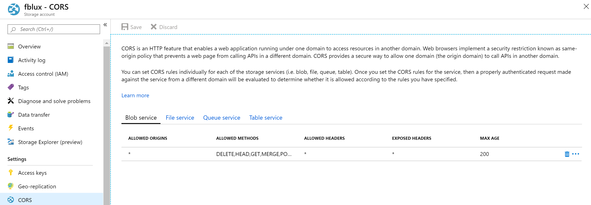

# OCR Form Labeling Tool

[](https://dev.azure.com/msazure/Cognitive%20Services/_build/latest?definitionId=118293&branchName=master)

An open source labeling tool for [Form Recognizer](https://docs.microsoft.com/en-us/azure/cognitive-services/form-recognizer/)

The purpose of this repo is to allow customers to better understand our labeling tool,  provide feedback, and make customer-specific changes to meet their unique needs.  Microsoft Azure Form Recognizer team will update the source code periodically.  If you would like to contribute, please check the contributing section.

OCR Form Labeling Tool is a React + Redux Web application, write in [TypeScript](https://github.com/Microsoft/TypeScript). This project was bootstrapped with [Create React App](https://github.com/facebook/create-react-app).

Features include:

* The ability to label forms in PDF, JPEG or TIFF formats
* Train model with labeled data through [Form Recognizer](https://docs.microsoft.com/en-us/azure/cognitive-services/form-recognizer/)
* Predict a single form with the trained model

## Getting Started

### Build and run from source

Form Labeling Tool requires [NodeJS (>= 10.x, Dubnium) and NPM](https://github.com/nodejs/Release)

   ```bash
    git clone https://github.com/Microsoft/OCR-Form-Tools.git
    cd OCR-Form-Tools
    npm run build
    npm run react-start
   ```
## Using labeling tool

### Set up input data

First, make sure all the training documents are of the same format. If you have forms in multiple formats, organize them into subfolders based on common format. When you train, you'll need to direct the API to a subfolder.

#### Configure cross-domain resource sharing (CORS)

Enable CORS on your storage account. Select your storage account in the Azure portal and click the **CORS** tab on the left pane. On the bottom line, fill in the following values. Then click **Save** at the top.

* Allowed origins = *
* Allowed methods = [select all]
* Allowed headers = *
* Exposed headers = *
* Max age = 200



### Create Connections

OCR Form Labeling Tool is a 'Bring Your Own data' (BYOD) application. In this tool, connections are used to configure and manage source (the assets to label) and target (the location to which labels should be exported). The source and target are the same location in OCR Form Labeling Tool. Eventually, they together will be inputs to [Form Recognizer](https://docs.microsoft.com/en-us/azure/cognitive-services/form-recognizer/).
Connections can be set up and shared across projects. They use an extensible provider model, so new source/target providers can easily be added.

Currently, both this labeling tool and [Form Recognizer](https://docs.microsoft.com/en-us/azure/cognitive-services/form-recognizer/) only support [Azure Blob Storage](https://docs.microsoft.com/en-us/azure/storage/blobs/storage-blobs-introduction).

To create a new connection, click the `New Connections` (plug) icon, in the left hand navigation bar.

Fill in the fields with the following values:

* **Display Name** - The connection display name.
* **Description** - Your project description.
* **SAS URL** - The shared access signature (SAS) URL of your Azure Blob Storage container. To retrieve the SAS URL, open the Microsoft Azure Storage Explorer, right-click your container, and select Get shared access signature. Set the expiry time to some time after you'll have used the service. Make sure the Read, Write, Delete, and List permissions are checked, and click Create. Then copy the value in the URL section. It should have the form: https://<storage account>.blob.core.windows.net/<container name>?<SAS value>.


### Create a new project

In the sample labeling tool, projects store your configurations and settings. Create a new project and fill in the fields with the following values:

* **Display Name** - the project display name
* **Security Token** - Some project settings can include sensitive values, such as API keys or other shared secrets. Each project will generate a security token that can be used to encrypt/decrypt sensitive project settings. You can find security tokens in the Application Settings by clicking the gear icon in the lower corner of the left navigation bar.
* **Source Connection** - The Azure Blob Storage connection you created in the previous step that you would like to use for this project.
* **Folder Path** - Optional - If your source forms are located in a folder on the blob container, specify the folder name here
* **Form Recognizer Service Uri** - Your Form Recognizer endpoint URL.
* **API Key** - Your Form Recognizer subscription key.
* **Description** - Optional - Project description


## Collaborators

This project is cloned and modified from [VoTT](https://github.com/microsoft/VoTT) project.

## Contributing

There are many ways to contribute to OCR Form Labeling Tool -- please review our [contribution guidelines](CONTRIBUTING.md).

This project has adopted the [Microsoft Open Source Code of Conduct](https://opensource.microsoft.com/codeofconduct/). For more information see
the [Code of Conduct FAQ](https://opensource.microsoft.com/codeofconduct/faq/) or contact [opencode@microsoft.com](mailto:opencode@microsoft.com)
with any additional questions or comments.
