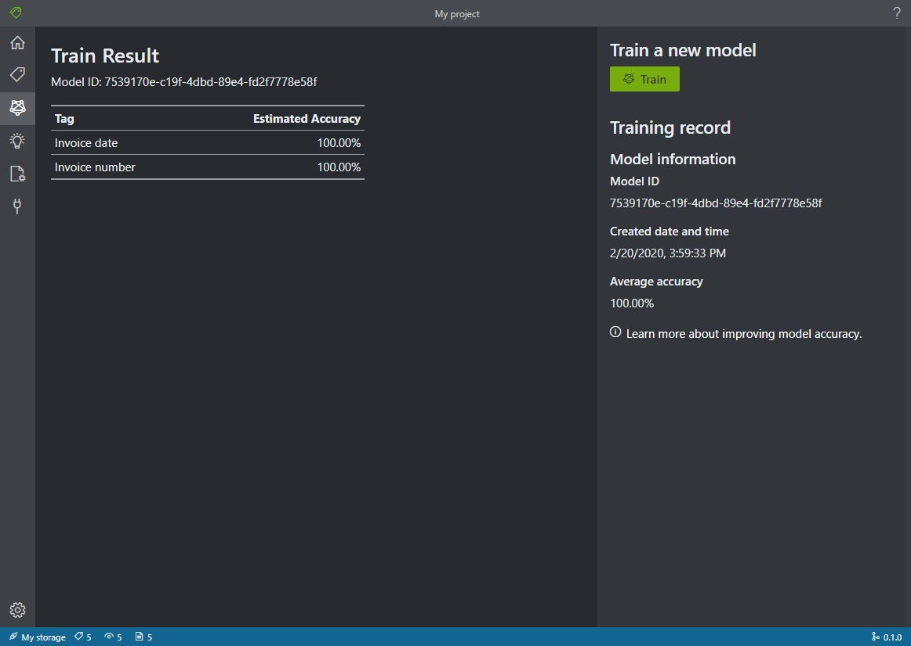
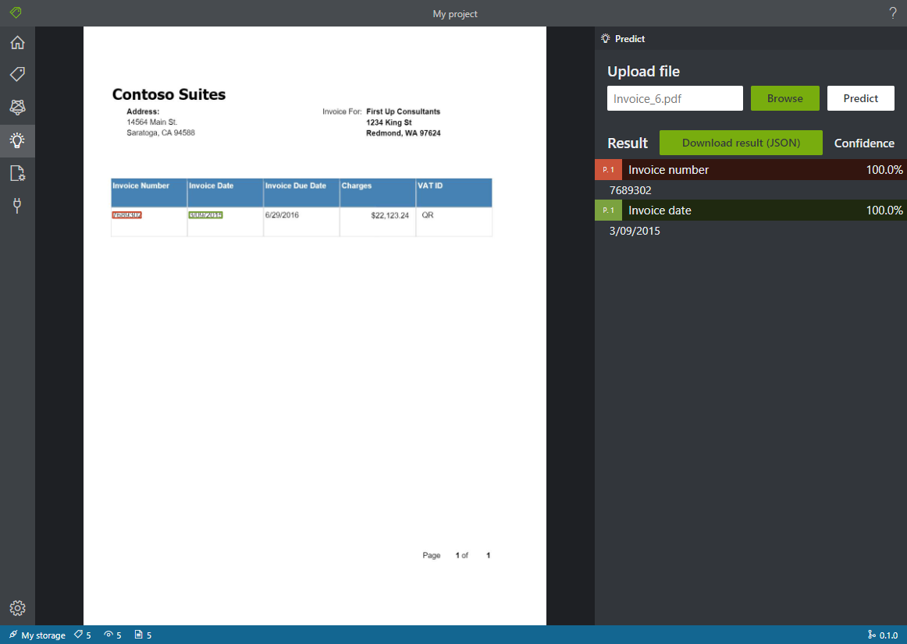

# OCR 表单标注工具( OCR Form Labeling Tool )

[](https://dev.azure.com/msazure/Cognitive%20Services/_build/latest?definitionId=118293&branchName=master)

这是一个开源的表单标记工具，该工具是为[Form Recognizer](https://docs.microsoft.com/en-us/azure/cognitive-services/form-recognizer/)项目而开发的，Form Recognizer 是表单ORC测试工具集 (Form OCR Test Toolset, FOTT) 的一部分。

本仓库的目的是开发并维护和微软表单识别和OCR服务相关的多种工具。目前，表单标注工具是首个发布到本仓库的工具。用户可以提供反馈并根据自己的需求做定制化改动。微软Azure表单识别团队将定期更新源代码。如果你希望参与此项目，请参考下文的参与贡献一节。

FOTT 的标注工具是一个由 React + Redux 开发的 Web 应用程序， 该项目使用 [Typescript](https://github.com/Microsoft/TypeScript) 语言开发。本项目使用 [Create React App](https://github.com/facebook/create-react-app) 启动。

当前标注工具具有下面这些特性：

* **标注** PDF、JPEG、TIFF等文档格式里的表单。 
* 通过 [Form Recognizer](https://docs.microsoft.com/en-us/azure/cognitive-services/form-recognizer/) 和标注数据来 **训练** 模型。
* 使用训练模型**预测**上述文档里的单张表单，进而从中提取表单里的 key/value 数据。 

## 开始( Getting Started )

### 从源码编译并运行( Build and run from source )

表单标注工具依赖 [NodeJS (>= 10.x, Dubnium) 和 NPM](https://github.com/nodejs/Release) 环境。

   ```bash
    git clone https://github.com/Microsoft/OCR-Form-Tools.git
    cd OCR-Form-Tools
    npm install
    npm run build
    npm run react-start
   ```

### 使用Docker安装（Set up this tool with Docker）

请参考这里的[指南](https://docs.microsoft.com/en-us/azure/cognitive-services/form-recognizer/quickstarts/label-tool#set-up-the-sample-labeling-tool)。

### 使用 Web 应用程序 ( Run as web application )

使用一个现代浏览器，可以直接加载并运行 FOTT 工具：https://fott.azurewebsites.net/

**注意： 该网站只是为了临时测试目的**

## 使用标注工具( Using labeling tool )

### 配置输入数据( Set up input data )

首先，确保所有的训练文档的格式是同一种。如果你有多种不同格式的文档，请按照格式用子文件夹组织。当你开始训练，你需要在API调用的地方指定对应的子文件夹。

#### 配置跨域资源共享( Configure cross-domain resource sharing, CORS )

在你的存储账号上允许 CORS. 选择你在Azure上的存储账号，在左侧的面板上点击 **CORS** 标签。在下面一行填入下面的配置。 然后点击顶部的 **保存** 按钮。 

```
* Allowed origins = *
* Allowed methods = [select all]
* Allowed headers = *
* Exposed headers = *
* Max age = 200
```


### 创建连接( Create Connections )

OCR 表单标注工具是一个 'Bring Your Own data' (BYOD) 应用。在这个工具里，`连接(Connection)`被用来配置和管理`源(Source)`（被标注的资源）和`目标(Target)`（标注应该被导出的位置）。`源(Source)`和`目标(Target)`在 OCR 表单标注工具里是同一个位置。最后，它们都被输入到 [Form Recognizer](https://docs.microsoft.com/en-us/azure/cognitive-services/form-recognizer/) 里。可以配置为多个项目共享的`连接(Connection)`。`连接(Connection)`被设计成一个可扩展的提供者(provider)模型，因此可以很容易添加新的`源(Source)`/`目标(Target)`提供者。

目前，标注工具和 [Form Recognizer](https://docs.microsoft.com/en-us/azure/cognitive-services/form-recognizer/) 都只支持一种存储： [Azure blob storage](https://docs.microsoft.com/en-us/azure/storage/blobs/storage-blobs-introduction).

如果要创建一个新的`连接(Connection)`，在左侧的导航栏上点击`新建(New Connection)` 加号按钮。

在下面的字段上填写对应的值：
* **Display Name** - 连接要显示的名字.
* **Description** - 项目描述.
* **SAS URL** - 你的Azure二进制存储容器的共享访问签名链接(SAS URL). 如何获取SAS URL呢？打开微软 Azure 存储浏览器，右键你的容器(注意：不是父存储节点)，选择获取共享访问签名。设置你开始使用标注服务后的过期时间，确保Read、Write、Delete和List权限被勾选上，点击创建。然后拷贝URL。URL的格式是：https://&lt;storage account&gt;.blob.core.windows.net/&lt;container name&gt;?&lt;SAS value&gt;.


### 创建一个新项目( Create a new project )

在标注工具里，一个项目被用来存储你的配置和设置。创建一个新项目并填写下面这字段对一个的值：

* **Display Name** - 项目名字
* **Security Token** - 一些项目设置可能包含敏感值，例如 API 密钥或其他共享密钥。每个项目都会生成一个安全令牌用以加密/解密项目敏感设置。你可以通过点击左侧导航栏下角的齿轮图标，打开应用设置查看安全令牌。
* **Source Connection** - 在上一个步骤创建的用以本项目的Azure二进制对象存储容器连接。
* **Folder Path** - 可选 - 如果你的表单数据放二进制容器的在子目录下，在这里指定对应的文件夹名字。
* **Form Recognizer Service Uri** - 你的 Form Recognizer 终端URL。格式应该是：https://&lt;your-name&gt;.cognitiveservcices.azure.com
* **API Key** - 你的 Form Recognizer 订阅密钥。
* **Description** - 可选 - 项目描述。


### 标注你的表单( Label your forms )

当你创建或打开一个项目，主标签(tag)编辑窗口会自动打开。标签编辑器包含了三个部分：

* 预览面板，显示了源连接里的表单列表，可以拖动滚动条浏览。
* 主编辑面板，允许你为文本添加标注。
* 标注编辑面板，允许你修改、排列或删除标注。

#### 识别文本元素和表单( Identify text elements and tables )

点击左侧面板的 **Run OCR on all files** 获取每个文档的文本布局信息。标注工具将绘制出围绕每个文本元素的轮廓边框，并在每个表单的左上角显示一个图标。当你点击表单图标，就会显示出该表单的识别边框。

#### 在文本中标注标签( Apply labels to text )

下一步，你将创建标注并在文本元素上应用以获得你想要的识别模型。文档里有很多 key/value ， 你希望训练模型来提取它们，第一步是标注这些 key/value. 例如，你看到了表单里的 `Charge: 1002.00` ，你可能希望标注值是` (1002.00)`，让AI模型会被训练出来，用以提取类似的表单信息。

1. 首先，使用标注编辑器面板创建你希望识别的标注，例如 "Cost".
2. 在主编辑器面板，从高亮文本元素里点击并拖动一个或多个单词。例如： "1002.00". 注意：目前不能选择跨越多页的文本。
3. 点击哪些你希望使用的标注，或者按下对应的键（例如，数字键'1'表示第1个标注）。你只能为每个选中的文本元素应用一个标注，并且每个标注只能在一个页面里被使用一次。

按照上面的步骤标注五个你的表单，然后进入到下一个步骤。


#### 指定标注类型和格式(Specify tag type and format)

你可以在标注的右键才对里指定标注类型和格式。类型和格式信息会被存储在源位置的feild.json文件里。这些信息在后期处理中会被用来改进数据以获得更好的结果。


#### 训练定制模型( Train a custom model )

点击左侧面板的训练图标，打开训练页面。然后点击**Train**按钮开始训练模型。一旦训练结束，你会看到如下的信息：

* **Model ID** - 被创建和训练的模型的唯一ID。每次训练调用，都会创建一个新的模型并拥有独立的ID。请拷贝这个ID对应的字符串到安全的位置保存。如果你希望通过 REST API 来预测表单数据，将会需要对应模型的ID。
* **Average Accuracy** - 模型的平均精度。你可以通过标注更多的表单数据，并重新训练一个模型来提高精度。我们建议从5张表单开始标注训练，然后按需增加。
* 标注列表，以及每个标注



当训练结束，检查平均准确率。如果太低了，你应该添加更多的输入文档，并重复上述标注步骤。那些你已经标注过的文档仍留在项目的索引里。

提示：你也可以调用 REST API 来运行训练过程。可以从这里学习如何调用训练 REST API：[Train with labels using Python](https://docs.microsoft.com/en-us/azure/cognitive-services/form-recognizer/quickstarts/python-labeled-data).

#### 分析一个表单( Analyze a form ) ####

点击左侧的预测图标，测试你的模型。上传一个没有被用来训练的表单文档。然后点击右侧的**Predict**按钮来获得该表单文档的 key/value 预测。预测工具会在表单边框上使用标签，并显示每个标注的信心指数。



提示：你也可以调用 REST API 来分析文档。可以从这里学习如何调用分析 REST API：[Train with labels using Python](https://docs.microsoft.com/en-us/azure/cognitive-services/form-recognizer/quickstarts/python-labeled-data).

#### 保存项目并随时重启（Save a project and resume later） ####

你需要保存安全令牌，便于在在另一个时间或另一个浏览器里重新登录并重启你的项目。

##### 获取项目凭据( Get project credentials ) #####

进入到你的项目设置页面( 文档设置图标 ) 并记下安全令牌名称。然后进入到你的应用程序设置页面（齿轮图标），查看当前浏览器里的所有安全令牌。找到你的项目安全令牌并拷贝名字、键值对到一个安全到地方保存。

##### 重置项目凭据( Restore project credentials ) #####

当你要重启你的项目，你首先需要创建一个连接到同一个二进制存储容器。重复上述步骤。然后，进入应用程序设置页面（齿轮图标），查看下你到项目安全令牌是否在那。如果不存在，则添加一个新的安全令牌并根据上一节拷贝令牌的名字和键值。然后点击保存设置。

##### 重启项目( Resume a project ) #####

最后，进入主页（房子图标）并点击打开云项目。然后选择二进制存储连接，接着选择你的项目.proj文件。应用程序将会使用安全令牌加载所有的项目设置。

#### 键盘快捷键( Keyboard Shortcuts ) ####

标注工具允许一些键盘快捷键以支持更方便快捷的标注操作。

热键包含数字`1`到`0`以及所有到字母键，它们被分配给前36个标注，当你从高亮文本元素里选择里一个或多个单词，你可以按下这些热键来标注选中的单词。

`[` 和 `]` 键可以被用来把选中单词移动到前一个或下一个。

`<` 和 `>` 键可以被用来在多个页面之间跳转到前一个或下一个页面。

`-`, `+` 以及 `/` 键可以被用来对编辑页面放大/缩小以及重置缩放。

按住 `Alt` 键并点击标注名字，用户可以改变标注的名字。

## 合作( Collaborators )

本项目从 [VoTT](https://github.com/microsoft/VoTT) 项目克隆并修改。

## 参与贡献( Contributing )

有很多方式可以给 OCR 表单标注工具提交贡献 -- 请参考[贡献指南](CONTRIBUTING.md).

本项目遵守[微软开源行为准则(Microsoft Open Source Code of Conduct)](https://opensource.microsoft.com/codeofconduct/). 更需信息请参考[行为准则常见问题解答(Code of Conduct FAQ)](https://opensource.microsoft.com/codeofconduct/faq/) 或者联系 [opencode@microsoft.com](mailto:opencode@microsoft.com) 查看任何其他问题和意见。


[English Version](https://github.com/microsoft/OCR-Form-Tools/blob/master/README.md) 

