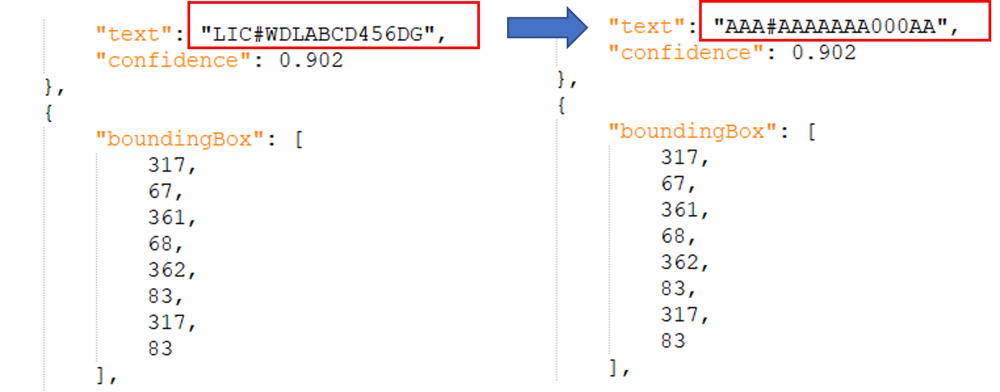

# Redact CLI

## Overview
The Redaction Tool enables you to remove Personally Identifiable Information (PII) or sensitive information from documents before sharing them with others. The tool will output a redacted image, redacted OCR.json file and redacted labels.json file.

Below is an example of an image before and after redaction.


The OCR.json and labels.json will also be redacted while keeping the semantics of the texts (e.g. length, upper/lower case, character/digit patterns, etc.)



## Version
Redact CLI 0.2.3

## Setup Environment

Ensure you have the following tools,
- Python 3.9 _or_ pyenv (for automatically installing Python 3.9)
- pipenv

### Linux / MacOS

1. Install `pyenv` for managing Python version.

```
pip install pyenv
```

2. Install `pipenv` for managing Python packages.

```
pip install pipenv
```

3. Install packages denoted in `Pipfile`.
```
cd redact_cli_py/
pipenv install
```

### Windows

1. Install `pyenv-win`. See https://github.com/pyenv-win/pyenv-win#installation

2. Install Python 3.9 manually because `pipenv` has not integrated well with `pyenv-win` yet.

```
pyenv install 3.9.4
pyenv rehash
```

Alternatively you can install Python 3.9 from official build manually and config the python path in `pipenv`.

3. Install `pipenv` for managing Python packages.

```
pip install pipenv
```

4. Install packages denoted in `Pipfile`.
```
cd redact_cli_py/
pipenv install
```
---
**NOTE**

If running into any errors, try running the above commands from an elevated Powershell terminal.

---

## Run

Take a look at the test data (`testdata/*`) first. These are the files for sanity checks.

### Activate the environment

There are 2 options to enable the correct python environment, both would achieve the same result:

1. run `pipenv shell`. In this way, the following commands in the same shell will run in the activated mode. E.g.,
```
pipenv shell
python redact.py <type> <path1> <path2> <path3>
pytest
```

2. prepend `pipenv run` to every command. E.g.,
```
pipenv run python redact.py <type> <path1> <path2> <path3>
pipenv run pytest
```

### Redact Image

``` bash
python redact.py image <image_path> <fott_label_path> <output_path>
```

### Redact OCR Result

``` bash
python redact.py ocr <ocr_result_path> <fott_label_path> <output_path>
```

### Redact FOTT Label Path

``` bash
python redact.py fott <fott_label_path> <output_path>
```

### Redact specific labels from Image, OCR results or FOTT Label Path
In some specific use-cases, the need may arise to redact specific labels from an image, OCR results or/and FOTT Label Path.
Labels to be redacted need to provided together in a string separated by commas.

If a document holds the following labels:
- Label_01
- Label_02
- Label_03
- Label_04

And _Label_01_ and _Label_04_ need to be redacted, the following commands can be leveraged:

#### Redact specific labels from Image

``` bash
python redact.py image <fott_label_path> <output_path> "Label_01,Label_04"
```
#### Redact specific labels from OCR Result

``` bash
python redact.py ocr <ocr_result_path> <image_path> <fott_label_path> <output_path> "Label_01,Label_04"
```
#### Redact specific labels from FOTT Label Path

``` bash
python redact.py image <image_path> <fott_label_path> <output_path> "Label_01,Label_04"
```

### Batch Redaction
Batch redaction supports redacting a folder rather than executing on a single file. Both the input and the output supports two sources:
1. local folder: a path to a folder on your local machine.
2. Azure Blob Storage virtual folder: a URL to a Blob Storage container and a folder path to denotes the folder.

``` bash
python batch_redact.py <input_container> <input_folder_path> <output_container> <output_folder_path>
```

#### Container
You can provide one of the two options:
1. `local`: this means you read/write data from local machine.
2. `https://<blob_account_url>/<container_name>?<sas_token>`: this means you read/write data from the container `container_name` of the Azure blob account `blob_account_url`. Please make sure your `sas_token` grants the correct access (Read/List for input, Read/Add/Create/Write/Delete/List for output).

#### Examples

1. Input from local folder 'raw/' and output to local folder 'redacted/'.
``` bash
python batch_redact.py local raw/ local redacted/
```

2. Download data from a Blob Storage v-folder `deep/folder/` in the container `data` and output to local folder `redacted/`.
``` bash
python batch_redact.py "https://my.blob.account/data?<my_secret_SAS_token>" deep/folder/ local redacted/
```

3. Redact and upload local `raw/` data to v-folder `deep/folder/` in the container `data`.
``` bash
python batch_redact.py local raw/ "https://my.blob.account/data?<my_secret_SAS_token>" deep/folder/
```

4. Get the data from a Blob Storage container `data` and the v-folder `folder1/`, redact it, and upload back to the same container with a different v-folder path `folder2/`.
``` bash
python batch_redact.py "https://my.blob.account/data?<my_secret_SAS_token>" folder1/ "https://my.blob.account/data?<my_secret_SAS_token>" folder2/
```

#### Note

1. Surround the URL with double quotes to prevent wrong character escape in the SAS token.
2. Visit [Create Your SAS tokens with Azure Storage Explorer](https://docs.microsoft.com/en-us/azure/cognitive-services/translator/document-translation/create-sas-tokens?tabs=Containers) to see how to create a SAS token for this program to use.
3. Currently, this redact CLI only support ASCII character redaction (Latin alphabets without the accent marks).

#### PDF Support

Batch mode now supports redacting data from one-page PDF documents. The tool will detect any PDF document in the input folder, convert to an image (.png) and redact the image itself placing it in the specified output folder upon completion.

#### Batch Redacting specific labels

Like the single file `redact.py` script, `batch_redact.py` supports redacting specific labels. Labels to be redacted need to provided together in a string separated by commas.
``` bash
python batch_redact.py local raw/ local redacted/ "Label_01,Label_02"
```


### Test

To run the unit tests, simply run

```
pytest
```

in the root folder.

### Note

1. You can also take a look at the `redact/__init__.py` file. The command line interface (CLI) is just a thin wrapper on `redact_image()`, `redact_ocr_result()`, and `redact_fott_label()`. You could extend the code on top of the three functions for achieving your own goal, such as to redact a batch of data.
2. For batch redaction, we currently only support `.jpeg`, `.jpg`, `.png`, `.tif`, `.tiff`, and `.bmp` as the file extension for images. PDF files are not supported.
