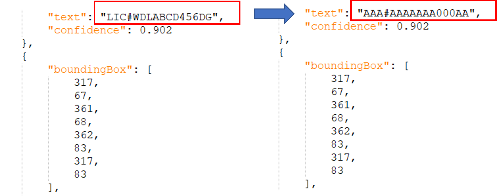
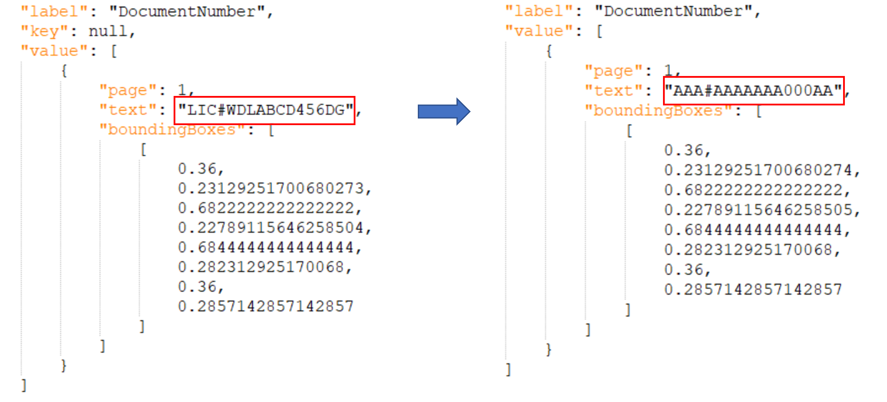

# How to use the Redaction Tool?

## Overview
The Redaction Tool is provided by Azure Form Recognizer team to help our customers who are willing to share/donate data with Microsoft that can share/donate data efficiently without privacy concern. It focuses on Personally Identifiable Information (PII) or sensitive data labeling and redaction while keeping the semantics of these fields (e.g. length of the values, character/digit patterns, upper/lower case etc.) for prebuilt model training. This is a step-by-step instruction to guide our you how to use the tool.

## Language support
This tool supports Latin characters redaction only. For any non-Latin document support, please [contact us](mailto:formrecog_contact@microsoft.com?subject=Redaction%20tool%20language%20support).

## Prerequisites
- Azure subscription - [Create one for free](https://azure.microsoft.com/free/cognitive-services)
- Once you have your Azure subscription, create a [Form Recognizer resource](https://ms.portal.azure.com/#create/Microsoft.CognitiveServicesFormRecognizer) in the Azure portal to get your key and endpoint.
- Create an Azure storage account with a container - following the [Azure Storage quickstart for Azure portal](https://docs.microsoft.com/en-us/azure/storage/blobs/storage-quickstart-blobs-portal). Use the *standard* performance tier.
- [Optional] If the data cannot leave your environment, you need to follow [this document](https://docs.microsoft.com/en-us/azure/applied-ai-services/form-recognizer/label-tool#set-up-the-sample-labeling-tool) to set up the labeling tool container.

## Step 1 - label the PII/sensitive fields with Sample Labeling Tool (FOTT)
* Assemble your raw images based on the input requirements below and [upload them into a blob storage container](https://docs.microsoft.com/en-us/azure/cognitive-services/form-recognizer/build-training-data-set#upload-your-training-data). Single-page PDF is supported for batch redaction only. You need to convert multi-page PDF files to images with below format before labeling.
  - Format must be JPG, JPEG, PNG, BMP or TIFF.
  - File size must be less than 50 MB.
  - Image dimensions must be between 50 x 50 pixels and 10000 x 10000 pixels.
* Generate a Shared access (SAS) token and URL for FoTT to access the blob storage. Make sure you have selected all the options including **Read**, **Add**, **Create**, **Write**, **Delete**, **List**, **Immutable storage** in “Permissions”.

* Go to [FoTT portal](https://fott-2-1.azurewebsites.net/) and create a new data connection by clicking on the left side navigation icon.

* Go to the homepage of FoTT portal and create a new project by clicking “Use Custom to train a model with labels and get key value pairs”.

* Once your project is created and opened, “Run layout on all documents” to get the OCR results with yellow bounding box first. This will make your tagging easier in later steps.

* Only label the PII or sensitive fields (refer to [Appendix](#appendix-pii-fields-reference)) by following [this guidance](https://docs.microsoft.com/azure/applied-ai-services/form-recognizer/label-tool?tabs=v2-1#label-your-forms). Please try to leverage the OCR detected results (aka. yellow bounding boxes) as much as possible. You can multi-select these bounding boxes to associate with a tag. If the value is not detected by OCR, or you want to redact a picture like profile image, you can *draw a region* to associate the area with the tag.

---
**NOTE**

It's better to label as fine-grained as possible, e.g. first name and last name in separate tags, city, zipcode, building address separately so that the redacted results can keep as much semantics as possible.

---

* Once you are done with the labeling, go to your blob storage container to check the images together with OCR and labeling results (*.ocr.json, *.labels.json).

## Step 2 – run redaction python scripts
The redaction python script is open sourced. You can follow the [instructions](README.md) to set up the environment, then choose one of the options to redact your data:
- Single image reaction - you need to download the image from blob storage to local machine then run `redact.py`
- Batch redaction - we support batch redacting images, labels.json and ocr.json from a local folder or Azure blob storage vertial folder.

## Step 3 - check redacted files and share with Microsoft.
Once redaction is completed, you can review and confirm if it's OK to share with Microsoft. Below is an example of an image before and after redaction.

The OCR.json and labels.json will also be redacted while keeping the semantics of the texts (e.g. length, upper/lower case, character/digit patterns, etc.)

please consolidate all the redacted images, redacted OCR results and redacted labels and [send them to us](mailto:formrecog_contact@microsoft.com?subject=Redacted%20data%20sharing). You can choose to upload to a shared storage if needed.

## Contact us
For any questions or feedback you have regarding this tool, please email us: formrecog_contact@microsoft.com.

## Appendix PII fields reference
### Customer Name
Names of people. 
For example, each of these would be marked as “Person Name.” 
- Abdul-Qahhar Abadi 
- Wesley Brooks 
- Jiang Li Liu 
- Dragoslava Simovic 
- Robert Downey jr.
Names should also be marked if they are *partial names* or *signature*. For example, the name “Camille Cartier” may also appear as “C. Cartier” or “Cartier, Camille”. Each of these should be marked as a Person Name. 
#### Exception: Person Names In Context 
When a name includes a person name but refers to an entity other than a person this should *NOT* be marked as “Person Name”. 
- Places named after people: “Lincoln, Nebraska”, “Martin Luther King Jr Boulevard”, or “Camille Carter Memorial Stadium.” 
- If a company is named after a person, for example “Grace Owens Plumbing Co, LLC” or “Gabriel Woods Consulting, Inc” or “Huang, Carlsen, & Amaya, Inc”. Exception: Title Please DO NOT include title which doesn’t belongs to person name, e.g. Mr., Ms., Dr.
#### Exception: Title
Please *DO NOT* include title which doesn’t belongs to person name, e.g. Mr., Ms., Dr.

### Personal Email
Label the full email address which includes domain name and email account.

### Unredacted Credit Card Number
Credit/debit card number. If more than 4 digits are shown in the trailing of numbers, we treat it as unredacted form. *We only label the unredacted credit card number.*
- XXXXXXXXXX53140 is an unredacted form. 
- A12XXXXXXXX53140 is an unredacted form. 
- XXXXXXXXXXX3140 is *NOT* an unredacted form. 
- 123XXXXXXXXX3140 is *NOT* an unredacted form. 
- 123XXXXXXXXX3140/XXXX is *NOT* an unredacted form. 
- AMEX-*3140 is *NOT* an unredacted form.

### Customer Address
Mailing address of the customer. Please note that we will need to label the full address, including streets, cities, country and postal code.

### Customer License number
Driver’s license number. Usually show up in parking receipt.

### Customer Membership Number
Any kind of membership number which could reference to customer should be included.

### Face Photo
If customer’s face photo is listed on document, please draw a region to cover the whole face.

### Other
Any other customer-related PII but not listed in above fields, please tag them as well.